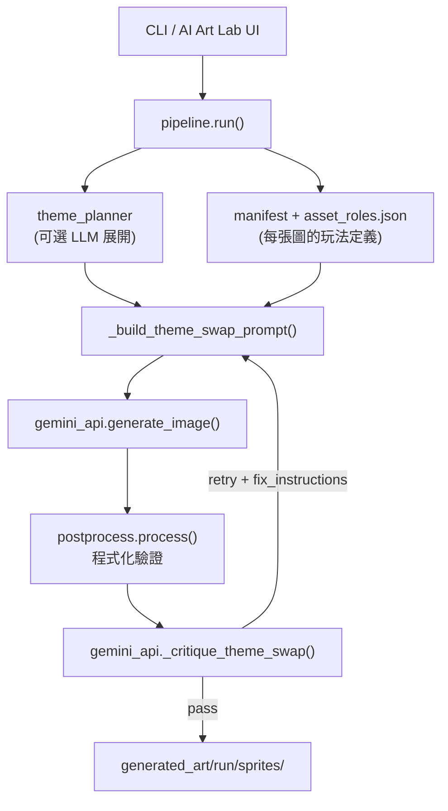
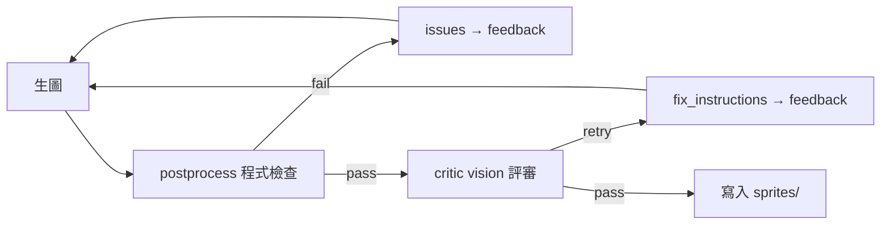

# Theme-Swap 生圖 Prompt 控制邏輯

> 說明 `theme-swap` 模式如何在不參考原圖的前提下，控制 AI 發明符合遊戲功能的新主題物件。  
> 程式入口：[`scripts/ai_art_gen.py`](../../scripts/ai_art_gen.py) → [`art_pipeline/pipeline.py`](../../art_pipeline/pipeline.py)

## 核心設計理念

theme-swap 與 restyle 的根本差異：

| | restyle | theme-swap |
|---|---|---|
| 參考原圖 | 必載入原 sprite 作 Reference A | **不載入**原圖 |
| 創作目標 | 保留物件，只換畫風 | **發明全新主題物件**，只保留玩法語意 |
| 評審基準 | 與原圖比對構圖/功能 | 僅依 abstract gameplay role 評審 |

CLI 的 `--mode theme-swap` 會轉成內部 `mode='theme_swap'`，再交給 `pipeline.run()`。



---

## 第一層：使用者輸入參數

### 必填 / 常用 CLI 參數

| 參數 | 作用 |
|------|------|
| `--style` | 畫風文字，注入 prompt 的 `[Target art style]` |
| `--theme` | 主題方向（概念型或手動 `Red=...`） |
| `--family` / `--assets` | 限定生成範圍（如 `elements` 五色、`powerups` 道具） |
| `--no-reference-image` | 不用 `game_art_reference.png` 或 `--style-image` |

範例（[`prompt.txt`](../../prompt.txt)）：

```bash
python scripts/ai_art_gen.py generate \
  --mode theme-swap \
  --style "3D Disney cartoon style, " \
  --theme "糖果屋" \
  --run candy_house \
  --family elements \
  --no-reference-image
```

代表：糖果屋主題、迪士尼 3D 卡通畫風、只生五色元素、不靠參考圖。

### 主題展開邏輯

實作於 `pipeline.resolve_expand_theme()`：

- **`--theme` 含 `=`**（如 `Red=草莓, Grn=薄荷糖`）→ **手動指派**，不自動展開
- **純概念文字**（如 `糖果屋`）→ **預設自動**呼叫 LLM 展開成每色物件
- `--no-expand-theme` 關閉、`--expand-theme` 強制開啟

展開結果寫入 `generated_art/<run>/report.json` 的 `theme_plan`；同概念重跑會快取。

---

## 第二層：主題規劃（LLM 拆成每張圖的物件）

[`art_pipeline/theme_planner.py`](../../art_pipeline/theme_planner.py) 的 `expand_theme_for_elements()`：

1. 輸入：`theme_concept`、`style_text`、目標 element 名稱列表
2. 用 critic 模型產出 JSON：`summary` + `assignments`（如 `{Red: "red gingerbread roof tile", ...}`）
3. 格式化為 `theme_direction`：`Red=..., Grn=..., Blu=..., Yel=..., Pur=...`

顏色約束在 planner prompt 中明確要求每個 element 的 dominant color 必須對應（`ELEMENT_COLOR_HINTS`）。

`theme_note_for_asset()` 在單張生成 prompt 末尾加上：

- `[Overall theme concept]` / `[Theme set summary]`
- `[This element's themed object]` — 該 asset 專屬物件描述

手動模式則從 `--theme` 字串用 `Red=...` 解析出對應項。

---

## 第三層：玩法角色定義（功能不能被換掉）

控制遊戲邏輯的核心在 [`art_pipeline/asset_roles.json`](../../art_pipeline/asset_roles.json)，由 [`art_pipeline/roles.py`](../../art_pipeline/roles.py) 載入並展開到 manifest。

### 三級結構

**1. `role_classes`** — 抽象玩法角色（跨 asset 共用）

每個 role 有 `theme_swap` 區塊，含 `creative_brief`、`preserve`、`avoid`。例如 `match_element`：

- `creative_brief`：發明新主題物件，顏色可辨即可
- `preserve`：`color_identity`, `single_centered_object`, `grid_readability`
- `avoid`：禁止複製原 sprite

其他 role：`powerup_horizontal`（橫向清除可讀性）、`obstacle_static_hp`（佔格、可破壞階段）等。可用 `python scripts/ai_art_gen.py list-roles` 查閱。

**2. `asset_groups`** — 具體 asset 的 function / constraints

五色元素範例：

- `function_theme_swap`：「Basic red match element — players match 3+ in a line to clear」
- `constraints`：dominant color、圓潤可密集排列等
- `params`：每色帶入 `color_en` 等模板變數

**3. `families`** — 系列一致性

如 `pool`：`Pool_lv1-lv5 are the SAME pool at 5 progressive depletion stages`；powerups 橫/直火箭需系列一致。

### 最終 Prompt 組裝

`_build_theme_swap_prompt()` 串成英文 prompt，結構如下：

```
Create a brand-new 2D match-3 game asset from scratch (theme-swap mode).

[Gameplay role] Match Element
[Creative brief] Invent a NEW themed object...
[Must preserve for gameplay readability]
- color_identity
- single_centered_object
- grid_readability
[Do NOT] Do not copy the original sprite...

[Asset slot name] Red
[Gameplay function] Basic red match element — ...
[Visual constraints]
- Dominant color must be unmistakably red ...
- A single centered object occupying 70%-90% ...

[Target art style] 3D Disney cartoon style
[Overall theme concept] 糖果屋
[This element's themed object] red gingerbread roof tile

[Output requirements]
- chromakey 背景規則
- NO FACIAL FEATURES
- Invent a completely NEW subject — do NOT replicate any original game sprite
- Square canvas, single image
[Series consistency] ...
[Fix instructions from previous attempt] ...  ← 迭代時注入
```

關鍵控制手段：

- **物件可換**：`creative_brief` + `avoid`
- **功能不可換**：`function_theme_swap` + `preserve` + per-asset `constraints`
- **主題可控**：`--theme` / `theme_plan.assignments`
- **畫風可控**：`--style`（+ 可選參考圖作 motif/palette）

### 參考圖在 theme-swap 的角色

`generate_one()` 中，theme-swap **不會**把原 PNG 加入 `refs`。若有 style image，標籤為 theme visual reference（motifs, palette, style）；prompt 要求用參考圖的視覺語彙但**發明新物件**，不複製 legacy sprite。

---

## 第四層：生成後驗證與迭代

每張 asset 最多 `--max-iters`（預設 3）次循環：



### 程式化驗證 — `postprocess.py`

不依 LLM，客觀檢查：

- chromakey 去背（綠色主體用洋紅幕，避免 key 掉主體）
- 主體佔畫面比例（`_MIN_BBOX_COVERAGE = 0.15`）
- 邊緣清理、白邊剝除

失敗時把 `issues` 塞回下一輪 prompt 的 `[Fix instructions]`。

### Vision 評審 — `_critique_theme_swap()`

**不比對原圖**，只評：

| 欄位 | 門檻 |
|------|------|
| `style_score` | ≥ 7 |
| `function_score` | ≥ 7 |
| `background_ok` | true |
| `reference_element_score` | ≥ 7（若有參考圖） |

評審 rubric 同樣注入 `function_theme_swap`、`creative_brief`、`preserve`、`constraints`、`series_note`。

---

## 不同 asset 類型的控制差異

| 情境 | family | 玩法控制重點 | 主題控制 |
|------|--------|-------------|---------|
| 糖果屋五色 | `elements` | 五色可辨、圓潤可密集排列 | LLM 展開 `糖果屋` |
| 海底世界 | `elements` | 同上 | 手動 `Red=珊瑚, Grn=海草...` |
| 蒸汽龐克道具 | `powerups` | 橫/直方向、爆炸感、飛行感等 | 概念型 `--theme` |
| 枯山水水池 | `pool` | 五級同一水池漸進枯竭 | 日式庭園主題 |

腳本範例：[`scripts/inference_scenarios/`](../../scripts/inference_scenarios/) 01–05。

---

## Web UI 對應

[`pages/6_AI_Art_Lab.py`](../../pages/6_AI_Art_Lab.py)「主題換物件」模式：

- 選 `theme_swap` → 主題概念輸入
- 偵測 `=` → 關閉自動展開
- 可「預覽主題展開」呼叫同一套 `theme_planner`
- 底層仍走 `pipeline.run(mode='theme_swap', ...)`

---

## Family 視覺分層（同 family 更一致、跨 family 更易區分）

適用 **theme-swap 與 restyle**。機制見 [`visual_guidance.py`](../../art_pipeline/visual_guidance.py)、[`family_style_planner.py`](../../art_pipeline/family_style_planner.py)。

### 三層控制

1. **靜態規則**（`asset_roles.json`）
   - `meta.visual_categories`：element / powerup / obstacle / background 的 cohesion 與跨類對照
   - `families.*`：`anchor_asset`、`cohesion`、`distinct_from_categories`

2. **Run 級規劃**（有 `--theme` 且 batch ≥2 張或 ≥2 family）
   - `family_style_planner` 產出 `report.json` → `family_style_plan`
   - 每 family 的 `shared_shape`、`material`、`ornament` 等 token

3. **Family anchor 鏈**
   - 生成順序：每 family 的 `anchor_asset` 先生（如 elements 的 `Red`）
   - 同 family 後續圖附上 anchor 作 Reference（對齊材質/線條，不複製 silhouette）
   - Critic 新增 `cohesion_score`（≥7）與 `distinction_score`（≥6，多 category batch 時）

### 除錯

- `report.json`：`family_style_plan`、verdict 內 `coh` / `dist` 分數
- UI：「預覽 family 視覺」按鈕（AI Art Lab theme-swap 面板）

---

## 控制權分佈（速查）

| 你想控制什麼 | 用什麼 |
|-------------|--------|
| 整體畫風 | `--style`（+ 可選 `--style-image`） |
| 主題世界觀 / 每色放什麼 | `--theme`（概念展開 or `Red=...` 手動） |
| 生成哪些 asset | `--family` / `--assets` |
| 遊戲功能語意（不可偏離） | `asset_roles.json` 的 `role_class.theme_swap` + `function_theme_swap` + `constraints` |
| 系列內一致性 | `families.*` + **family anchor 鏈** + `cohesion_score` |
| 跨 family 區分 | `visual_categories` + `distinct_from_categories` + `distinction_score` |
| 技術輸出規格 | chromakey、`NO_FACE_RULE`、`common_sprite_constraints` |
| 品質把關 | postprocess + critic 迭代 + `fix_instructions` 回饋 |

**一句話**：theme-swap 把「原圖長什麼樣」換成「這個格子在遊戲裡扮演什麼角色」——用 JSON 角色表鎖住玩法，用 `--theme` 解鎖創意主題，再用雙層驗證確保可玩性與畫風達標。

## 除錯建議

- `--dry-run`：看第一張 target 的完整 prompt（不呼叫生圖 API）
- `generated_art/<run>/report.json`：查 `theme_plan` 與每次迭代的 `verdict`
- `generated_art/<run>/history/<asset>/`：保留每次迭代的圖與分數
